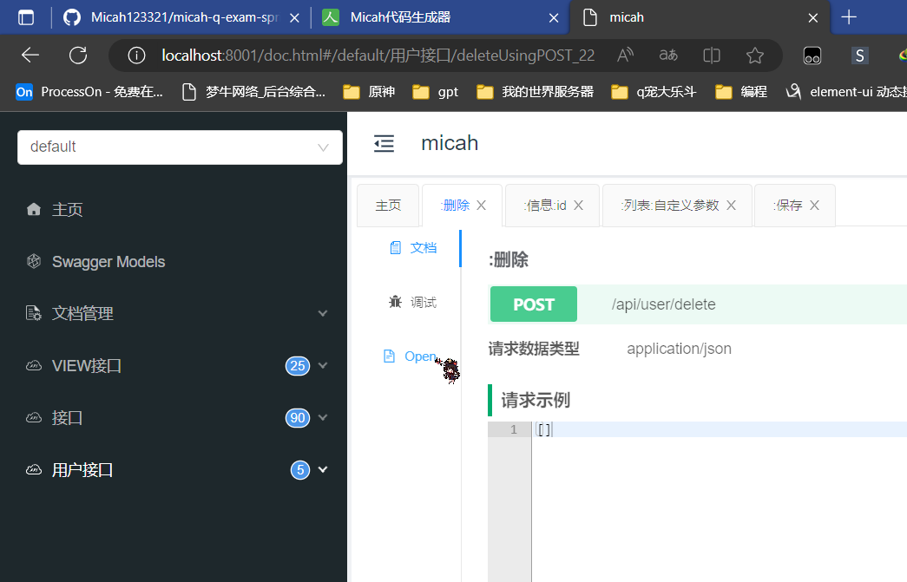

# micah-q-exam-springboot
用于快速搭建一个适用于springboot+mybatisplus+swagger+简易token鉴权拦截的例子

# 使用方法
1. 使用`git clone git@github.com:Micah123321/micah-q-exam-springboot.git` 克隆拖入idea
2. 设定项目结构为 jdk 版本为1.8
3. 导入数据库到sqlyog 复制数据库名字
4. 在[application.yml](micah-generator%2Fsrc%2Fmain%2Fresources%2Fapplication.yml)中修改数据库账号密码 数据库
5. 也在[application-dev.yml](src%2Fmain%2Fresources%2Fapplication-dev.yml)修改
6. 将[micah-generator](micah-generator)导入为maven项目
7. 运行[RenrenAppGenlication.java](micah-generator%2Fsrc%2Fmain%2Fjava%2Fio%2Frenren%2FRenrenAppGenlication.java)
8. 访问本地 81 端口下载自动生成的代码
9. 下载,导入 注意将entity下的文件创建一个dao包放入进去
10. 运行例子项目
11. 进入 8001端口/doc.html 调试接口
12. 生成的分类与注释取决于你有没有搞好数据库注释
13.  这种就是没有做好注释的
